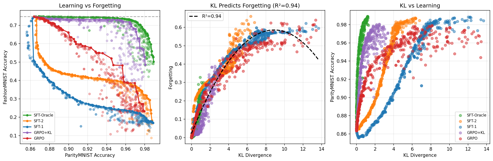
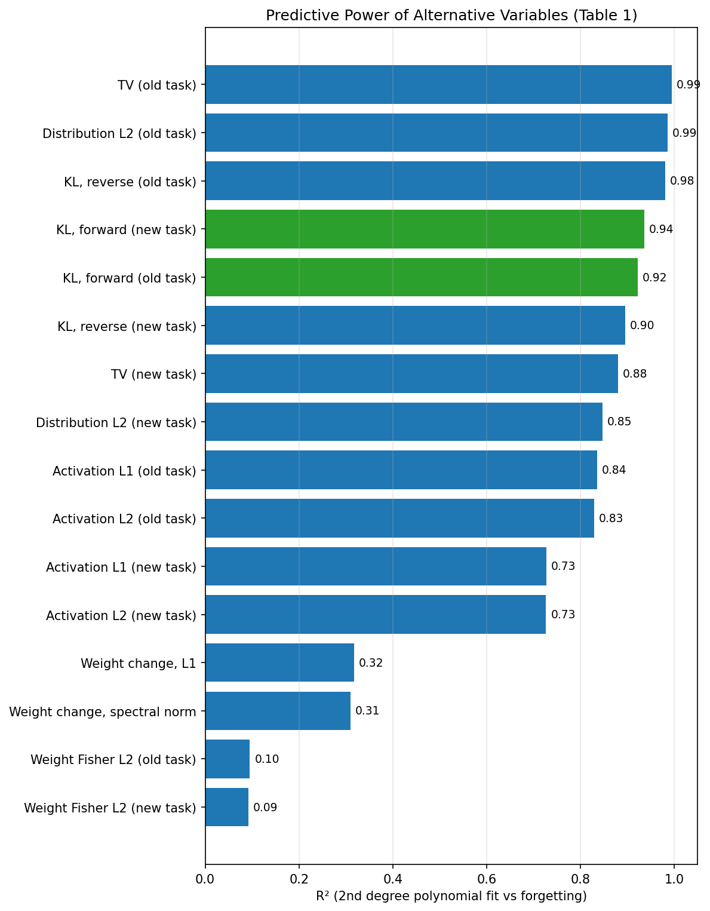

# RL's Razor - MNIST result replication

Replication of the MNIST experiments from paper [RL's Razor: Why Online Reinforcement Learning Forgets Less](https://arxiv.org/abs/2509.04259), demonstrating that **KL divergence from the base model predicts catastrophic forgetting**.

## Key Findings from the Paper

1. **RL fine-tuning forgets less than SFT** — On-policy methods naturally stay closer to the base model
2. **KL divergence predicts forgetting** — Strong linear correlation between KL(π₀ || π) and accuracy drop
3. **Oracle SFT matches RL** — When SFT uses the KL-minimal label distribution, it achieves the same Pareto frontier as RL

## Replicated Results

Figure 3: KL divergence from the base model predicts forgetting (accuracy drop on old task) and learning (accuracy on new task). RL methods achieve better trade-offs by staying closer to the base model.


Table 1: Predictive power (R²) of different metrics for forgetting (accuracy drop on old task). 


## Installation

```bash
# install
pip install -e .

# Or install dependencies directly
pip install torch torchvision numpy wandb matplotlib scikit-learn pyyaml tqdm
```

## Quick Start

See the following scripts
- `scripts/pretrain.sh` for pretraining on ParityMNIST + FashionMNIST
- `scripts/finetune.sh` for fine-tuning with different methods (GRPO, SFT variants)
- `scripts/plot.sh` for collecting results from fine-tuning runs, generating plots, and computing Table 1 metrics
- `scripts/analyze_drift_trajectory.sh` for computing CKNNA representational drift trajectories

## The Experiment

### Setup

- **ParityMNIST**: MNIST digits where the task is to predict parity (even vs odd)
  - Multiple correct answers exist (e.g., for an even digit, outputs 0, 2, 4, 6, 8 are all correct)
  - This is key: it allows different fine-tuning methods to find different solutions

- **FashionMNIST**: Standard 10-class classification (used to measure forgetting)

- **Joint Pretraining**: Train on 500 samples from each task with a task indicator (+1 for parity, -1 for fashion)

### Fine-tuning Methods

| Method | Description | Label Distribution |
|--------|-------------|-------------------|
| **SFT-1** | Supervised, deterministic | Even→0, Odd→1 |
| **SFT-2** | Supervised, limited diversity | Even→{0,4}, Odd→{1,5} |
| **SFT-Oracle** | Supervised, KL-minimal | q*(y) ∝ π₀(y) for correct y |
| **GRPO** | Policy gradient | On-policy sampling |
| **GRPO+KL** | Policy gradient + KL penalty | On-policy with regularization |

### Why RL Forgets Less

SFT forces the model toward a specific output distribution (e.g., always predict 0 for even digits). This can be far from the base model's distribution, causing large parameter changes and forgetting.

RL (GRPO) only requires correct parity — it naturally preserves the base model's preferences among correct answers, resulting in smaller KL divergence and less forgetting.

## Project Structure

```
rl_razor/
├── src/rl_razor/
│   ├── data.py              # Data loading with task indicators
│   ├── model.py             # 3-layer MLP (785 → 512 → 256 → 10)
│   ├── metrics.py           # KL, CKNNA, accuracy, Section 6 alternative metrics
│   ├── utils.py             # Seeds, checkpointing, logging
│   └── training/
│       ├── pretrain.py      # Joint pretraining
│       ├── sft.py           # Supervised fine-tuning
│       ├── grpo.py          # Policy gradient (GRPO)
│       └── oracle.py        # KL-minimal distribution
├── scripts/
│   ├── pretrain.py                    # Pretraining CLI
│   ├── finetune.py                    # Fine-tuning CLI (computes all metrics)
│   ├── plot.py                        # Plotting, and Table 1
│   └── analyze_drift_trajectory.py    # CKNNA representational drift trajectories
└── configs/
    └── sweep.yaml           # Wandb sweep configuration
```

## Detailed Usage

### Pretraining

```bash
python scripts/pretrain.py \
    --epochs 50 \
    --lr 1e-3 \
    --n-samples 500 \
    --scheduler cosine_with_warmup \
    --wandb
```

### Fine-tuning

```bash
# GRPO (RL without KL regularization)
python scripts/finetune.py \
    --pretrained-model path/to/model.pt \
    --method grpo \
    --lr 1e-4 \
    --epochs 2

# GRPO with KL regularization
python scripts/finetune.py \
    --pretrained-model path/to/model.pt \
    --method grpo_kl \
    --kl-coef 0.1

# SFT variants
python scripts/finetune.py --pretrained-model path/to/model.pt --method sft1
python scripts/finetune.py --pretrained-model path/to/model.pt --method sft2
python scripts/finetune.py --pretrained-model path/to/model.pt --method oracle
```

### Hyperparameter Sweep

Run the full sweep (~500 configurations per method) using Weights & Biases:

```bash
# Initialize sweep
wandb sweep configs/sweep.yaml

# Run agents (on multiple machines if desired)
wandb agent <sweep_id>
```

Sweep parameters (from paper Appendix B.3):
- Learning rates: 15 values log-spaced in [3e-6, 1e-3]
- Schedulers: constant-with-warmup, cosine-with-warmup
- Epochs: 1 or 2 (checkpointing every 0.25 epochs)

### Plotting

```bash
python scripts/plot.py \
    --results-dir path/to/finetune_dir \
    --pretrained-results path/to/pretrain_dir/results.json \
    --output-dir path/to/plot_dir
```

Generates:
- **`figure3.png`**: All three panels side by side
    - Pareto frontiers per method (Figure 3 left)
    - KL vs forgetting with polynomial fit (Figure 3 middle)
    - KL vs new task accuracy (Figure 3 right)
- **`table1.png`**: Bar chart of R² per metric (Table 1)
- **`summary.json`**: Aggregated statistics including predictive power table

### Metrics Explained (Table 1)

Since the paper does not specify which dataset to use for data-dependent metrics, **each data-dependent metric is computed on both the new task (ParityMNIST) and the old task (FashionMNIST)**, yielding `_new` and `_old` variants. Data-independent weight metrics are computed once.

| Metric | Category | Variants | Description |
|--------|----------|----------|-------------|
| **KL, forward** | Distributional | `_new`, `_old` | KL(π₀ ∥ π): expected log-ratio of base model probabilities to fine-tuned probabilities |
| **KL, reverse** | Distributional | `_new`, `_old` | KL(π ∥ π₀): reverse direction KL divergence |
| **TV** | Distributional | `_new`, `_old` | Total variation: 0.5 · E_x[Σ_y \|π₀(y\|x) − π(y\|x)\|] |
| **Distribution L2** | Distributional | `_new`, `_old` | L2 distance between output probability vectors: E_x[\|\|π₀(·\|x) − π(·\|x)\|\|₂] |
| **Weight Fisher L2** | Weight-level | `_new`, `_old` | EWC-style distance: Σᵢ Fᵢ · (θᵢ − θ₀ᵢ)², where F is the diagonal Fisher on the respective dataset |
| **Weight spectral norm** | Weight-level | (none) | Sum of largest singular values of per-layer weight delta matrices |
| **Weight L1** | Weight-level | (none) | Mean absolute parameter change: (1/d) · Σᵢ \|θᵢ − θ₀ᵢ\| |
| **Activation L2** | Activation-level | `_new`, `_old` | L2 distance between hidden-layer (ReLU) activations on the respective dataset |
| **Activation L1** | Activation-level | `_new`, `_old` | L1 distance between hidden-layer (ReLU) activations on the respective dataset |

Result keys use suffixes `_new` (ParityMNIST) and `_old` (FashionMNIST), e.g. `forward_kl_new`, `activation_l2_old`. The key finding is that **distributional metrics** (especially forward KL on new-task data) are far better predictors of forgetting than weight-level or activation-level metrics.

### Representational Drift Trajectories (CKNNA)

To observe *representational drift* — where internal representations change over training even when task accuracy remains stable — use the drift trajectory script.  It computes CKNNA similarity between the base model and each saved checkpoint, and plots how this similarity evolves during fine-tuning for runs with different amounts of forgetting.

```bash
python scripts/analyze_drift_trajectory.py \
    --results-dir experiments/sweep_pretrain_epoch2 \
    --pretrained-model experiments/pretrain_*/pretrained_model.pt \
    --output-dir plots/drift_trajectory \
    --probe-task old \   # FashionMNIST (neutral probe), or 'new' / 'both'
    --k 10 \             # k-NN neighborhood size
    --n-samples 2000     # probe samples for CKNNA (subsampled for tractability)
```

Generates:

- **`cknna_mean_trajectories.png`**: Mean ± std CKNNA trajectory per method
- **`cknna_trajectories_by_forgetting.png`**: Per-run trajectories, color = forgetting intensity
- **`cknna_trajectories_by_quartile.png`**: Mean trajectories grouped into forgetting quartiles
- **`cknna_vs_forgetting.png`**: Final CKNNA vs forgetting scatter (analogous to Figure 3 middle)
- **`trajectories.json`**: Raw trajectory data for further analysis

**CKNNA (Centered Kernel Alignment with k-NN masking, Huh et al. 2024):**
```
K = XX⊤,   L = YY⊤
K̄ = HKH,   L̄ = HLH    (H = I − (1/n)11⊤, centering matrix)
α(i,j) = 1 iff i,j are mutual k-NNs in K̄  OR  mutual k-NNs in L̄  (union)
CKNNA = ⟨K̄, L̄⟩_α / √(⟨K̄, K̄⟩_α · ⟨L̄, L̄⟩_α)
```
Score = 1.0 when representations have identical local neighborhood structure; lower scores indicate more drift.  Setting k = n−1 (all neighbors) recovers standard CKA.
